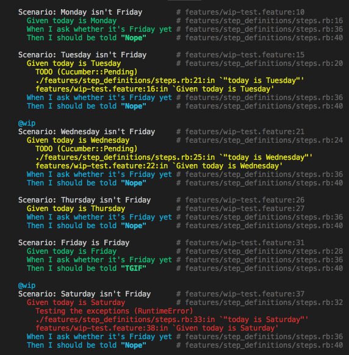

# Tags skipping test

This is a simple test of how skipping certain tags works in Cucumber. Is very much based on https://docs.cucumber.io/guides/10-minute-tutorial/

We have some passing scenarios, some undefined steps, some pending steps, one failing step and on top of that some scenarios tagged as `@wip`.

Our goal here is to determine what is reported by cucumber in overall statistics when we skip certain tests.

## Preparation

* Clone the repository
* Run `bundle install --path vendor/bundle`

## Experiment

### Upfront summary

* Cucumber completely ignores scenarios that are not present in the run (i.e. marked with a tag which is excluded)
* Apparently scenario is marked as `undefined` or `pending` if any of its steps has that status respectively and scenario doesn't crash before reaching that state
* Steps that are not evaluated for whatever reason (`failed`, `pending` or `undefined` scenario) are marked as `skipped`
* Everything else looks to work the way I would expect it to work:
  * Missing step marks the scenario as `undefined`
  * Steps marked as `pending` mark the scenario as `pending`

If you run the commands yourself with color support enabled you'll see `passed` steps as green, `skipped` steps as cyan, `pending` and `undefined` steps as yellow, and `failed` steps as red. Color code may differ a bit for different terminals.




### Run the tests with no skipped scenarios

Cucumber displays the expected stats: 
```
7 scenarios (1 failed, 1 undefined, 2 pending, 3 passed)
21 steps (1 failed, 8 skipped, 1 undefined, 2 pending, 9 passed)
```

Full output (run it yourself to see the color-code):
```
$ bundle exec cucumber
Feature: Is it Friday yet?
  Everybody wants to know when it's Friday

  Scenario: Sunday isn't Friday        # features/wip-test.feature:4
    Given today is Sunday              # features/step_definitions/steps.rb:12
    When I ask whether it's Friday yet # features/step_definitions/steps.rb:36
    Then I should be told "Nope"       # features/step_definitions/steps.rb:40

  @wip
  Scenario: Monday isn't Friday        # features/wip-test.feature:10
    Given today is Monday              # features/step_definitions/steps.rb:16
    When I ask whether it's Friday yet # features/step_definitions/steps.rb:36
    Then I should be told "Nope"       # features/step_definitions/steps.rb:40

  Scenario: Tuesday isn't Friday       # features/wip-test.feature:15
    Given today is Tuesday             # features/step_definitions/steps.rb:20
      TODO (Cucumber::Pending)
      ./features/step_definitions/steps.rb:21:in `"today is Tuesday"'
      features/wip-test.feature:16:in `Given today is Tuesday'
    When I ask whether it's Friday yet # features/step_definitions/steps.rb:36
    Then I should be told "Nope"       # features/step_definitions/steps.rb:40

  @wip
  Scenario: Wednesday isn't Friday     # features/wip-test.feature:21
    Given today is Wednesday           # features/step_definitions/steps.rb:24
      TODO (Cucumber::Pending)
      ./features/step_definitions/steps.rb:25:in `"today is Wednesday"'
      features/wip-test.feature:22:in `Given today is Wednesday'
    When I ask whether it's Friday yet # features/step_definitions/steps.rb:36
    Then I should be told "Nope"       # features/step_definitions/steps.rb:40

  Scenario: Thursday isn't Friday      # features/wip-test.feature:26
    Given today is Thursday            # features/wip-test.feature:27
    When I ask whether it's Friday yet # features/step_definitions/steps.rb:36
    Then I should be told "Nope"       # features/step_definitions/steps.rb:40

  Scenario: Friday is Friday           # features/wip-test.feature:31
    Given today is Friday              # features/step_definitions/steps.rb:28
    When I ask whether it's Friday yet # features/step_definitions/steps.rb:36
    Then I should be told "TGIF"       # features/step_definitions/steps.rb:40

  @wip
  Scenario: Saturday isn't Friday      # features/wip-test.feature:37
    Given today is Saturday            # features/step_definitions/steps.rb:32
      Testing the exceptions (RuntimeError)
      ./features/step_definitions/steps.rb:33:in `"today is Saturday"'
      features/wip-test.feature:38:in `Given today is Saturday'
    When I ask whether it's Friday yet # features/step_definitions/steps.rb:36
    Then I should be told "Nope"       # features/step_definitions/steps.rb:40

Failing Scenarios:
cucumber features/wip-test.feature:37 # Scenario: Saturday isn't Friday

7 scenarios (1 failed, 1 undefined, 2 pending, 3 passed)
21 steps (1 failed, 8 skipped, 1 undefined, 2 pending, 9 passed)
0m0.062s

You can implement step definitions for undefined steps with these snippets:

Given("today is Thursday") do
  pending # Write code here that turns the phrase above into concrete actions
end
```

### Run the tests with skipped tag @wip


Cucumber completely ignores scenarios that are not present in the run: 
```
4 scenarios (1 undefined, 1 pending, 2 passed)
12 steps (4 skipped, 1 undefined, 1 pending, 6 passed)
```

Full output (run it yourself to see the color-code):
```
$ bundle exec cucumber -t ~@wip
Deprecated: Found tags option '~@wip'. Support for '~@tag' will be removed from the next release of Cucumber. Please use'not @tag' instead.
Feature: Is it Friday yet?
  Everybody wants to know when it's Friday

  Scenario: Sunday isn't Friday        # features/wip-test.feature:4
    Given today is Sunday              # features/step_definitions/steps.rb:12
    When I ask whether it's Friday yet # features/step_definitions/steps.rb:32
    Then I should be told "Nope"       # features/step_definitions/steps.rb:36

  Scenario: Tuesday isn't Friday       # features/wip-test.feature:15
    Given today is Tuesday             # features/step_definitions/steps.rb:20
      TODO (Cucumber::Pending)
      ./features/step_definitions/steps.rb:21:in `"today is Tuesday"'
      features/wip-test.feature:16:in `Given today is Tuesday'
    When I ask whether it's Friday yet # features/step_definitions/steps.rb:32
    Then I should be told "Nope"       # features/step_definitions/steps.rb:36

  Scenario: Thursday isn't Friday      # features/wip-test.feature:26
    Given today is Thursday            # features/wip-test.feature:27
    When I ask whether it's Friday yet # features/step_definitions/steps.rb:32
    Then I should be told "Nope"       # features/step_definitions/steps.rb:36

  Scenario: Friday is Friday           # features/wip-test.feature:31
    Given today is Friday              # features/step_definitions/steps.rb:28
    When I ask whether it's Friday yet # features/step_definitions/steps.rb:32
    Then I should be told "TGIF"       # features/step_definitions/steps.rb:36

4 scenarios (1 undefined, 1 pending, 2 passed)
12 steps (4 skipped, 1 undefined, 1 pending, 6 passed)
0m0.045s

You can implement step definitions for undefined steps with these snippets:

Given("today is Thursday") do
  pending # Write code here that turns the phrase above into concrete actions
end
```
